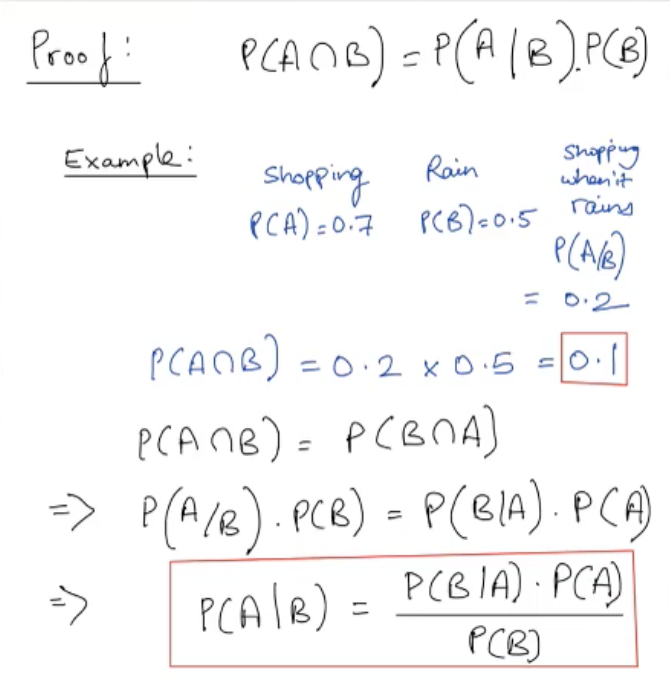
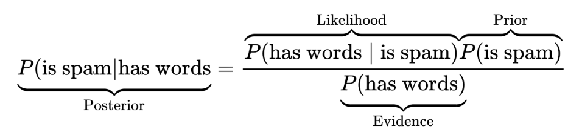

## Introduction to Bayes Theorem

In the 1700s, Reverend Thomas Bayes came up with the original research that would become Bayes’ theorem. Pierre-Simon Laplace extended Bayes’ research to produce the beautiful result we know today. Bayes’ theorem is as follows:

- Let's say we have two events A and B. The probability of occurence of A is $P(A)$ and that of B is $P(B)$.
- Bayes Therom: $P(A|B) = \frac{P(B|A)*P(A)}{P(B)}$
- $P(B|A)$ is the conditional probability of occurrence of B given that the event has already occurred
- $P(A)$ represents the **Prior** probability of event A.
- $P(B)$ represents the prior probability of the total probability of event B [Normalisation Factor].
- $P(A|B)$ is called the **Posterior Probability**
- $P(B|A)$ is aslo called the **likelihood**

Naive Bayes is a linear classifier. To understand it, we need to understand some basic and conditional probabilities.



The NBC is a probabilistic classifier based on applying Bayes’ theorem with strong (naive) independence assumptions. In a nutshell, an NBC assigns inputs into one of the k classes {C1, C2, ..., Ck} based on some properties (features) of the inputs. NBCs have applications such as email spam filtering and document classification.



- The prior probability that an email is spam
- The likelihood of encountering these word in a spam email
- The evidence; that is, the probability of seeing these words in an email

## Navie Bayes
The Na¨ıve Bayes algorithm comes from a generative model. There is an important distinction between generative and discriminative models. In all cases, we
want to predict the label y, given x, that is, we want $P(Y = y|X = x)$.

$$P(Y|x_1,x_2,x_3....x_j) = \frac{P(x_1,...x_j) P(Y)}{P(x_1,x_2,x_3....x_j)}$$

Data [Independent variables OR n features]= $(X)$ = $\{x_1, x_2, x_3....x_n\}$

Classes [K Possible Outcomes] = $C$ = $\{C_1, C_2, C_3....C_k\}$

### Understanding 
Given a Data point $x$, we want to find what is the probability that it belong to a particular class among $C$ classes.
$$P(C_k|X) \frac{P(C_k)P(X|C_k)}{P(X)}$$ where x $(X)$ = $\{x_1, x_2, x_3....x_n\}$

Breaking down **Numerator**: <br></br>
For given a data point `x` <br></br>
- $P(C_k)P(X|C_k)$ = $P(x\cap C_k)$ = $P(x,C_k)$ <br></br>  

we now compute for each of the classes. <br></br>
$P(C_1|x)$, $P(C_2|x)$, $P(C_3|x)$, $P(C_4|x)$.....$P(C_k|x)$ <br></br>
Now, what's happening here is for all the above calculation of numerator the *Denominator* is always same.

At the end, we only pick one of classes that gives the highest probability values, ex: among all, maybe class3 gives the highest value $P(C_3|x)$, so pick pick class3 for the given data point `x`.
Now, x belong to $C_3$

As mentioned earlier, for all the numerator computations, the *Denominator* stays always same.
As *Denominator* is constant, so which of them is largest dosen't depend on the *Denominator*. We can ignore the *Denominator*

In a data set reprsentation, the Numerator can be represented as:

$P(C_k)P(X|C_k)$ = $P(X\cap C_k)$ = $P(X,C_k)$ <br></br>
Which is called as the **joint Probability Model**


$P(X,C_k)$ = $P(x_1, x_2, x_3, x_4,....,x_n, C_k)$ = $P(C_k, x_1, x_2, x_3, x_4,....,x_n)$

which can be rewritten, using the chain rule for repeated applications of the definition of conditional probability.


= $P(x_1, x_2, x_3, x_4,....,x_n, C_k)$ <br></br>
           - By the defination of conditional probability

If we consider $x_1$ as $A$ and the rest as $B$ then $P(A \cap B) = P(A|B)P(B)$  <br></br>
= $P(x_1 | x_2, x_3....C_k)P(x_2, x_3...C_k)$<br></br>
           - By the defination of conditional probability to the second term
= $P(x_1 | x_2, x_3....C_k)P(x_2| x_3...C_k)P(x_3, x_4...,C_k)$ <br></br>
= $P(x_1 | x_2, x_3....C_k)P(x_2| x_3...C_k)P(x_3|x_4...,C_k)P(x_4, x_5,....C_k)$ <br></br>
= $P(x_1 | x_2, x_3....C_k)P(x_2| x_3...C_k)...P(x_{n-1}|x_n,C_k)P(x_n|C_k)P(C_k)$

Now, the issue is computing each probabilites is a huge task and heavy

Now the "naive" **conditional independence assumptions** come into play: assume that all features in ${\displaystyle}\mathbf {x}$  are mutually independent, conditional on the category ${\displaystyle C_{k}}$. Under this assumption,

**Simple Indepencence:** <br></br>
$P(A|B)=P(A)$ <br></br>
**Conditional Independence:** <br></br>
$P(A|B,C)= P(A|B \cap C) = P(A|C)$ <br></br>
We can say, $A$ and $B$ are conditionally independent given $C$


        Appling Conditional Indepndence
$${\displaystyle P(x_{i}\mid x_{i+1},\dots ,x_{n},C_{k})=P(x_{i}\mid C_{k})\,}.$$


Thus, the joint model can be expressed as

${\displaystyle {\begin{aligned}p(C_{k}\mid x_{1},\dots ,x_{n})&\varpropto p(C_{k},x_{1},\dots ,x_{n})\\&=p(C_{k})\ p(x_{1}\mid C_{k})\ p(x_{2}\mid C_{k})\ p(x_{3}\mid C_{k})\ \cdots \\&=p(C_{k})\prod _{i=1}^{n}p(x_{i}\mid C_{k})\,,\end{aligned}}}$

By removing the proportionality and getting back to the left *Denominator*

$${\displaystyle p(C_{k}\mid x_{1},\dots ,x_{n})={\frac {1}{Z}}p(C_{k})\prod _{i=1}^{n}p(x_{i}\mid C_{k})}$$

where the evidence $${\displaystyle Z=p(\mathbf {x} )=\sum _{k}p(C_{k})\ p(\mathbf {x} \mid C_{k})}$$

Now, given a point `x` what is the my class lable?
As we will compute $P(C_k|x)$, which means we reange the k value from 1 to n, among all of them we choose the maximum value that particular `k` has given and will that $C_k$ as the class label, 

This process is called **MAP Maximum a Posteriori**

The Fianl Class Label is:

$${\displaystyle {\hat {y}}={\underset {k\in \{1,\dots ,K\}}{\operatorname {argmax} }}\ p(C_{k})\displaystyle \prod _{i=1}^{n}p(x_{i}\mid C_{k}).}$$

## Reference
[MIT 15.097](https://ocw.mit.edu/courses/sloan-school-of-management/15-097-prediction-machine-learning-and-statistics-spring-2012/lecture-notes/MIT15_097S12_lec07.pdf),
[Hands-on ML](https://learning.oreilly.com/library/view/hands-on-machine-learning/9781789346411/4dc854ef-7ebb-4d3b-979b-f42b5b4f9340.xhtml),
[Wikipedia](https://en.wikipedia.org/wiki/Naive_Bayes_classifier),
[Navie Bayes for SMS Spam](https://learning.oreilly.com/videos/data-science-and/9781634627788/9781634627788-V9781634627788_7?autoplay=false)


```python

```


```python

```
